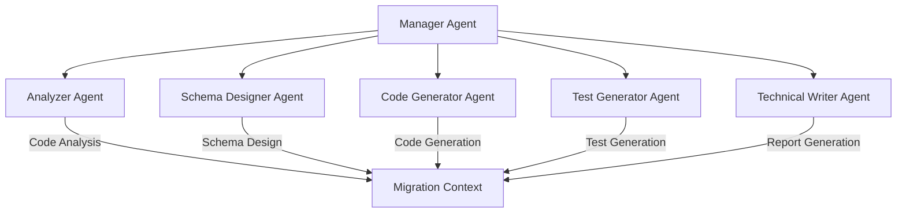
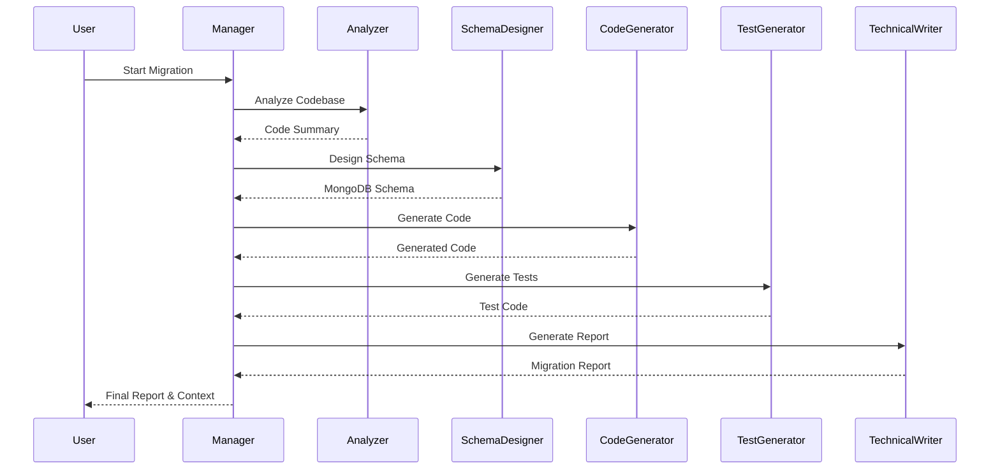

# Assignment

Migrate a specific legacy JBoss Java application to a more modern platform according to the following directives:

The application you will be dealing with is the 'kitchensink' JBoss application available in the Red Hat JBoss EAP Quickstarts GitHub repository (no need to analyse any of the other applications listed there)
The target stack to modernise this application is the latest stable version of Spring Boot or Quakus (your choice) based on Java 21 working with MongoDB, moving away from the Relational database.
Build a generic purpose tool that analyses a java application and creates a migration plan to make the code work with MongoDB.
The tool can use LLM's to analyse the codebase and build a migration plan
Stretch goal: The tool can also suggest a schema for MongoDB based on the static code scan. It would be great.
You can build this tool in any language of your preference.

Example:

Codebase: https://github.com/spring-projects/spring-petclinic

Migration plan built by LLM for pet clinic repo: https://gist.github.com/mutukrish/7245a99f6c795cf79b6bb455db88789e

# Java Migration Tool

A CLI tool that uses LLMs to help migrate legacy Java Spring applications to Spring Boot + MongoDB.

---

## 🚀 Features

- Analyze Java codebase and extract structure
- Generate LLM-based migration plan to Spring Boot 3.x + MongoDB
- Optional MongoDB schema suggestion
- Markdown or JSON report output
- Agentic approach with multiple specialized agents
- Comprehensive migration reports with implementation details

---

## 📦 Setup

1. Install Python dependencies using [`uv`](https://github.com/astral-sh/uv):

```bash
uv pip install -e .[dev]
pre-commit install
```

2. Install code2prompt CLI tool:

```bash
# Using Cargo (recommended)
cargo install code2prompt

# Or using Homebrew
brew install code2prompt
```

## Usage

```bash
# Using the static analyzer (default)
poe run --analyzer static

# Using code2prompt analyzer
poe run --analyzer code2prompt

# Generate MongoDB schema suggestions
poe run --schema

# Output in JSON format
poe run --output json

# Run in agentic mode
poe run --mode agentic
```

## Implementation Details

### Agentic Architecture

The tool uses an agentic approach with multiple specialized agents working together:



### Migration Flow



### Agent Responsibilities

1. **Manager Agent**

   - Coordinates the migration process
   - Maintains migration context
   - Orchestrates agent communication

2. **Analyzer Agent**

   - Analyzes Java codebase
   - Identifies entities and relationships
   - Extracts repository interfaces

3. **Schema Designer Agent**

   - Designs MongoDB schemas
   - Handles relationships and indexing
   - Provides schema validation

4. **Code Generator Agent**

   - Generates Spring Data MongoDB code
   - Handles entity mappings
   - Creates repository interfaces

5. **Test Generator Agent**

   - Generates test cases
   - Includes unit and integration tests
   - Uses test containers

6. **Technical Writer Agent**
   - Generates comprehensive reports
   - Documents migration steps
   - Provides implementation details

### Output Files

The tool generates two main output files:

1. `migration_report_{timestamp}.md`: Detailed migration report in Markdown format
2. `migration_context_{timestamp}.json`: Raw migration context and analysis results

## TODO

### P1

- [ ] Add ability to execute the mongo DB code schema and provide feedback
- [ ] Add ability to update Java files (code, tests), run tests and provide feedback
- [ ] Move Code Analyzer service as an an MCP server to demonstrate the concept

### P2

- [ ] Add human in loop agentic pattern with memory
- [ ] Provide a mechanism (memoty?) for when the repo is big and it doesn't fix model context
- [ ] Add UI for human in loop pattern
- [ ] use code2prompt to curate prompt
- [ ] Clone repo if it does not exist
- [ ] Enable code2prompt as MCP Server? https://code2prompt.dev/docs/how_to/install/#model-context-protocol-mcp
