# Java Migration Tool

A CLI tool that uses LLMs to help migrate legacy Java JBoss applications to Spring Boot + MongoDB.

## Table of Contents

- [Java Migration Tool](#java-migration-tool)
  - [Table of Contents](#table-of-contents)
  - [🚀 Features](#-features)
  - [Usage](#usage)
    - [Quick Test](#quick-test)
    - [Local setup](#local-setup)
  - [Migration Modes](#migration-modes)
    - [Agentic Mode](#agentic-mode)
    - [Agent Responsibilities](#agent-responsibilities)
  - [Output Files](#output-files)
    - [Sequential Mode](#sequential-mode)
  - [TODO](#todo)
    - [P0](#p0)
    - [P1](#p1)
    - [P2](#p2)

## 🚀 Features

- Analyze Java codebase and extract structure
- Generate LLM-based migration plan to Spring Boot 3.x + MongoDB
- Schema validation for proposed schema against actual mongodb server
- Comprehensive migration reports and trajectory

## Usage

### Quick Test

1. Creaet a copy of the env file using `cp .env.template .env`
2. populate the values for `AZURE_OPENAI_ENDPOINT` and `AZURE_OPENAI_API_KEY`. This configuration has been tested on Azure OpenAI
3. Run following commands to clone the target repository and generate the migration report for it

```bash
git clone git@github.com:jboss-developer/jboss-eap-quickstarts.git cloned_repos/jboss-eap-quickstarts/
docker compose run --rm -it migration-tool --local-repo-path "cloned_repos/jboss-eap-quickstarts/kitchensink/" --report-path "migration_report.md"
```

### Local setup

```bash
pip install uv
uv sync --all-extras
docker compose up -d
poe run --local-repo-path "cloned_repos/jboss-eap-quickstarts/kitchensink/" --report-path "migration_report.md"
```

## Migration Modes

### Agentic Mode

The agentic mode uses multiple specialized agents working together in a group chat context moderated by `GroupChatManager`. Validators like `SchemaValidator` will run the LLM generated content (e.g. mongo collection schema) against actual resources (e.g. mongodb server) and provide feedback in the chat so `SchemaDesigner` can fix it if necessary.

```mermaid
%%{init: {
"theme": "default",
"themeVariables": {
"actorBkg": "#dbe9ff",
"actorBorder": "#2f6fdb",
"actorTextColor": "#0b2447",
"sequenceMessageColor": "#1c1c1c"
}
}}%%

sequenceDiagram
participant User
participant Manager
participant AnalyzerAgent as Analyzer Agent
participant SchemaDesignerAgent as Schema Designer Agent
participant SchemaValidatorAgent as Schema Validator Agent
participant MongoDB
participant CodeGeneratorAgent as Code Generator Agent
participant TestGeneratorAgent as Test Generator Agent
participant TechnicalWriterAgent as Technical Writer Agent

    Note right of SchemaValidatorAgent: 🐳 Runs in Docker container
    Note right of MongoDB: 🐳 Containerized MongoDB

    User->>Manager: Start Migration
    Manager->>AnalyzerAgent: Analyze Codebase
    AnalyzerAgent-->>Manager: Code Summary
    Manager->>SchemaDesignerAgent: Design Schema
    SchemaDesignerAgent-->>Manager: Initial Schema

    rect rgb(220, 235, 255)
    Manager->>SchemaValidatorAgent: Validate Schema
    SchemaValidatorAgent->>MongoDB: Query/Test Schema
    MongoDB-->>SchemaValidatorAgent: Response
    SchemaValidatorAgent-->>Manager: Validation Feedback
    end

    rect rgb(255, 240, 230)
    Manager->>TestGeneratorAgent: Run Validation Tests (Not Implemented Yet)
    TestGeneratorAgent-->>Manager: Test Run Validation Feedback
    end

    Manager->>SchemaDesignerAgent: Refine Schema
    SchemaDesignerAgent-->>Manager: Final Schema
    Manager->>CodeGeneratorAgent: Generate Code
    CodeGeneratorAgent-->>Manager: Generated Code
    Manager->>TestGeneratorAgent: Generate Tests
    TestGeneratorAgent-->>Manager: Test Code
    Manager->>TechnicalWriterAgent: Generate Report
    TechnicalWriterAgent-->>Manager: Migration Report
    Manager-->>User: Final Report & Context
```



### Agent Responsibilities

1. **Manager Agent**

   - Coordinates the migration process
   - Maintains migration context
   - Orchestrates agent communication

2. **Analyzer Agent**

   - Analyzes Java codebase
   - Identifies entities and relationships using `javalang` python package
   - Extracts repository interfaces

3. **Schema Designer Agent**

   - Designs MongoDB schemas
   - Handles relationships and indexing
   - Iterates on schema based on validation feedback

4. **Schema Validator Agent**

   - Validates MongoDB schema designs
   - Provides feedback on schema structure
   - Ensures schema follows best practices
   - Checks for potential performance issues

5. **Code Generator Agent**

   - Generates Spring Data MongoDB code
   - Handles entity mappings
   - Creates repository interfaces

6. **Test Generator Agent**

   - Generates test cases
   - Includes unit and integration tests
   - Uses test containers

7. **Technical Writer Agent**
   - Generates comprehensive reports
   - Documents migration steps
   - Provides implementation details

## Output Files

The tool generates two main output files (if `--report-path` is not provided)

1. `reports/migration_report_{timestamp}.md`: Detailed migration report in Markdown format
2. `reports/migration_trajectory_{timestamp}.json`: The trajectory of the agentic implementation for observibility

### Sequential Mode

The sequential mode provides a straightforward, step-by-step migration process. This is similar to [Autogen's Sequential Flow](https://microsoft.github.io/autogen/stable/user-guide/core-user-guide/design-patterns/sequential-workflow.html) which I implemented first to get an understand of whether it works.


## TODO

### P0

- [x] Make sure user can test easily through docker compose
- [x] Update docs
- [ ] Commit sample report and trajectories for both kitchensink and spring-petclinic

### P1

- [x] Add ability to execute the mongo DB code schema and provide feedback
- [ ] Add test executor agent
- [ ] Add ability to update Java files (code, tests), run tests and provide feedback
- [ ] Move Code Analyzer service as an MCP server to demonstrate the concept

### P2

- [ ] Add human in loop agentic pattern with memory
- [ ] Provide a mechanism (memory) for when the repo is big and it doesn't fit model context
- [ ] Add UI for human in loop pattern
- [ ] Use code2prompt to curate prompt
- [ ] Clone repo if it does not exist
- [ ] Enable code2prompt as MCP Server
